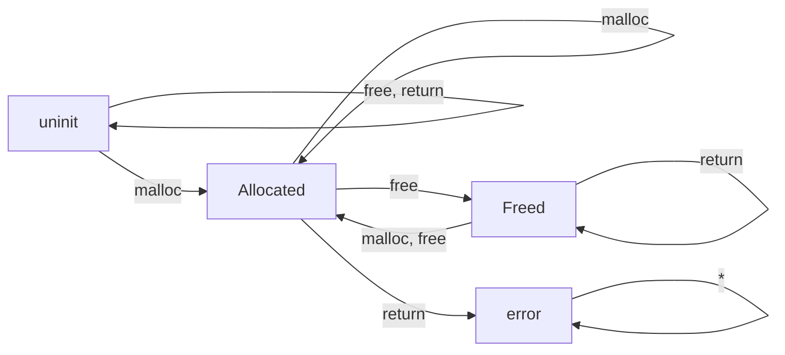
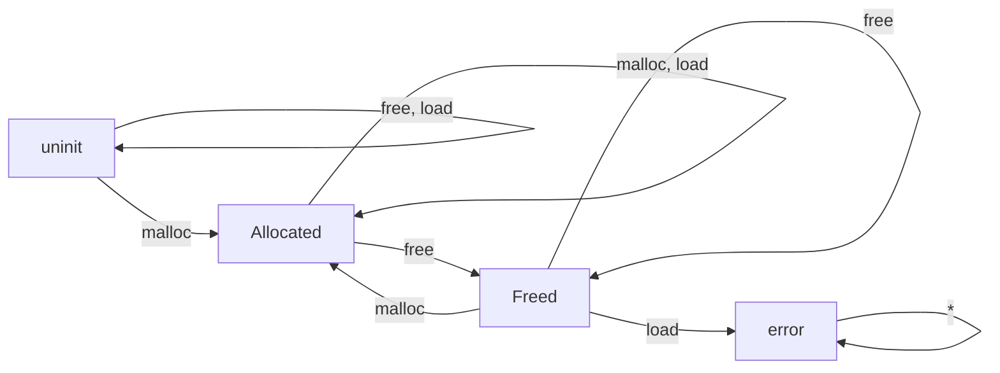

# 1.ESP Basic

The FSM for memory leak is:



FSM for double free：


FSM for use after free：



For PSTA, it will first conduct a Andersen style pointer analysis and build sparse value flow graph using [SVF](https://github.com/SVF-tools/SVF).
Then like bug detection is [Saber](https://github.com/SVF-tools/SVF/tree/master/svf/include/SABER), PSTA will first mark all sources and sinks (For memory leak, no sink; For double free, sink is `free`; For use after free, the sink is `print` callsite or all loads statement.)
For example, in the following code, `malloc_wrapper(16)`, `malloc(8)`, `(struct data_st*)malloc_wrapper(sizeof(struct data_st))` will be marked as sources.

For each source point, PSTA will traverse ICFG from `main` to program exit point once to do a typestate analysis. 
This means that the ICFG is traversed multiple times.
For each time, PSTA will use SVFG to mark the typestate transition CFG nodes for the sources, and conduct IFDS analysis on the marked ICFG.
This indicate that PSTA is based on a context-insensitive, flow-insensitive pointer analysis.

During analysis, a symbolic state for a program point is composed of type state and execution state, the execution state stores abstract value (1, 0, or $\top$) for each memory object or top level pointer each program points,
which will not affect type state analysis much but will be used to assist branch condition solving.
Also, if you add `-otf-alias`, that indicated you are gonna using a more precised flow-sensitive pointer analysis results from execution states.

```c
struct data_st* global_st;

struct data_st 
{
    char *tmp_store;
};

void* malloc_wrapper(size_t len)
{
    return malloc(len);
}

void foo(int c)
{
    struct data_st *st = (struct data_st*)malloc_wrapper(sizeof(struct data_st));
    void* ptr = malloc_wrapper(16);

    st->tmp_store = ptr;    // delete this leak will be detected
    
    free(st);               // no leak
    if (c > 10) free(ptr);  // partial leak
}

int main(int argc,char** argv) 
{
    struct data_st *sptr = (struct data_st*)malloc_wrapper(sizeof(struct data_st));
    global_st = sptr;       // no leak, poison malloc_wrapper to be global
    foo(argc);
    void *p = malloc(8);
    return 0;
}
```